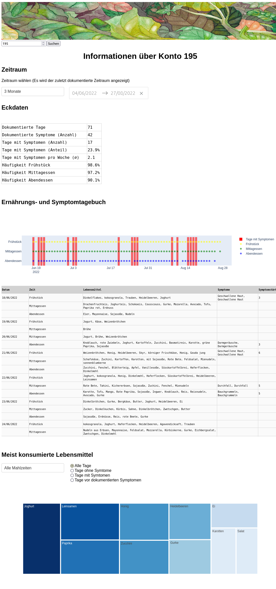
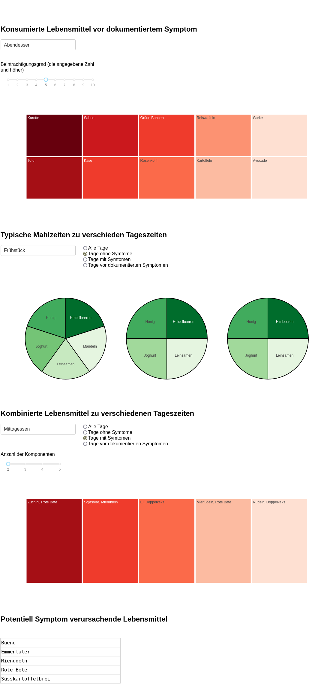
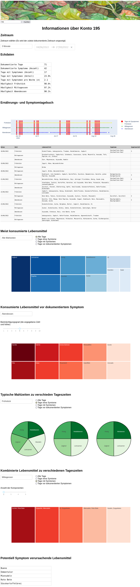

# Plotly Dashboard

## Screenshots
.                          |  .
:-------------------------:|:-------------------------:
|

## This app has the following file structure
<pre>
dashboard_app
├──.env (is to be placed here by the user)
├──assets/
│  │  └── banner.png
├──app.py
├──computations.py
├──constants.py
├──data_access.py
├──data_filtering.py
├──data_processing.py
├──developer_toolkit.py
├──plotting_toolkit.py
├──table_toolkit.py
├──units.py
├──requirements.txt
└──README.md
</pre>

## Getting started:
- make sure that all the files of this app (app.py, etc) are in one folder (e.g. "dashboard_app")
- make sure that the data (from the csv files) is stored in a database
- make sure `.env` with your database credentials is in this folder
- cd into that folder
- in `constants.py` change the values of `DRIVER` and `SCHEMA` to match your SQL database driver name and the name of your schema
- $ python3 -m venv .venv (or python -m venv .venv)
- $ source .venv/bin/activate
- $ pip install --upgrade pip
- $ pip install -r requirements.txt
- $ python app.py
- goto http://127.0.0.1:8050/ _(or the address displayed in the message)_
- or run `app.py` from your IDE
- if errors: tinker with the constants `DATABASE`, `USER`, etc in the `make_sqlalchemy_engine` function on the `data_access.py` module

## Notes for the maintenance
- to activate/deactivate the debugging mode change the value of the `DEBUG` variable in `constants.py`
- in the `DEBUG` mode in the browser you will see:
    - error messages from Plotly Dash when the app is running _(these are caught and do not actually stop the execution of the app)_
    - the actual selector values which are passed into an individual plotting function
    - the data which is used to make a plot _(this table will show to you whether the filtering of rows had been done correctly for this particular plot)_

- in the `DEBUG` mode in the console you will see:
    - the arguments generated by the `get_callback_args` function, which get to be passed into an individual decorator which wraps the callback function for an individual unit.

## Basic checklist to follow when adding a new unit:
- define your new unit in the `units.py` module. A unit will consist of:
    - title of the unit _(e.g. h2 html tag)_
    - selectros _(dropdown, radio buttons, etc)_
    - plot
- include the new unit in the `app.layout` on the `app.py` module
- write a callback function for the new unit _(use the `make_figure_test` plotting function to make a generic plot for starters)_
    - use the `get_callback_args` function or write out the arguments for the decorator with hard-coding
    - think thoroughly about which values the tuple `components` will include
    - think about what your callback function will return
- write a plotting function for the new unit
- replace the generic plot in the callback function with your plotting function.

## TODO and Further Ideas

### More functionality
- bar chart showing the distribution of symptoms over the week (7 bars, WE is shaded)
    - count of days with symptoms?
    - count of symptoms?
    - average severity?

### Frontend
- "different visualization (e.g. color) for weekdays and weekends": shade weekends on the timeline plot?
- shade weekends in the "conventional" diary table?
- The color of the "complaint" bar can represent the average severity on that day (from rosy to deep red if 10 is the severity of complaints)
- make the colors on the "pies chart" consistent (e.g. butter must be the same color on all (three) pies)
- hoverover / tooltips explaining the meaning of an individual plot
- arrange the units into (two) columns with the dash bootstrap library

### Backend
- other NLP / fuzzy-matching techniques to clean up displayname (for runtime only of course) - in addition to the regex for 'displayname' which is already implementd.
- all table names and column names -> constants.py? Make them consisient: all on constants.py or in the function definitions?
- make toy data to make this app independent of the data provided
- docs

  

